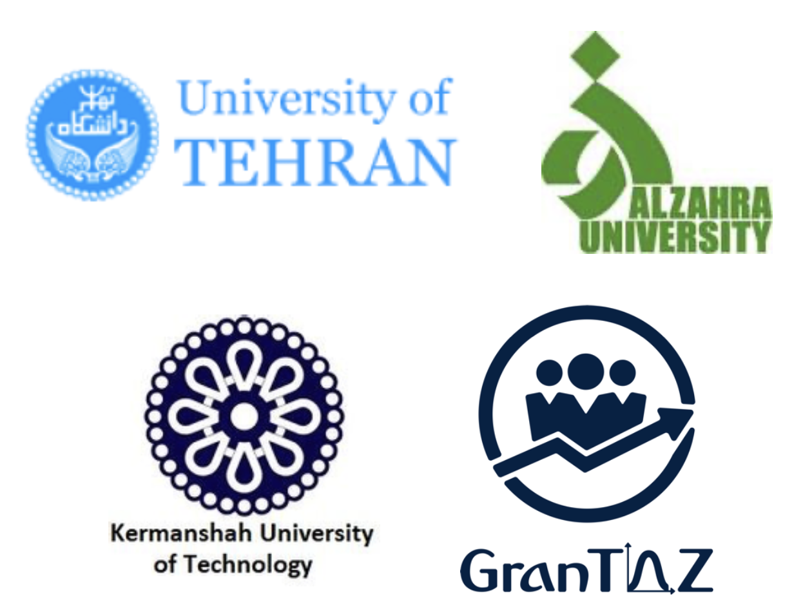

Welcome to relAI, a leading private professional company dedicated to revolutionizing maintenance strategies using the power of artificial intelligence. At relAI, we specialize in leveraging cutting-edge AI technologies to identify and implement optimal maintenance approaches for a wide range of systems. Our team of expert data scientists and engineers work tirelessly to analyze vast amounts of data, uncover patterns, and generate actionable insights. By harnessing the potential of AI, we empower organizations to make data-driven decisions that enhance system performance, reduce downtime, and maximize operational efficiency. With a focus on innovation and excellence, relAI is your trusted partner in unlocking the full potential of AI-driven maintenance strategies.

## Features

- Advanced AI Analytics: Harness the power of advanced AI algorithms to analyze vast amounts of data and extract valuable insights for optimized maintenance strategies.
- Predictive Maintenance: Leverage predictive analytics to anticipate system failures, enabling proactive maintenance and minimizing costly downtime.
- Customized Solutions: Tailor-made maintenance strategies to suit the unique needs of your specific systems, maximizing operational efficiency and lifespan.
- Real-time Monitoring: Continuous monitoring of system performance and health in real-time, enabling prompt identification of potential issues and swift corrective actions.
- Data-driven Decision Making: Make informed decisions based on comprehensive data analysis, ensuring optimal resource allocation and improved maintenance outcomes.

## Partners

relAI is hosted within Collaboration for Reliability and AI research within Faculty of Applied Sciences at University of Tehran. Our partners include University of Tehran, Al-Zahra University, and Kermanshah University of Technology.

